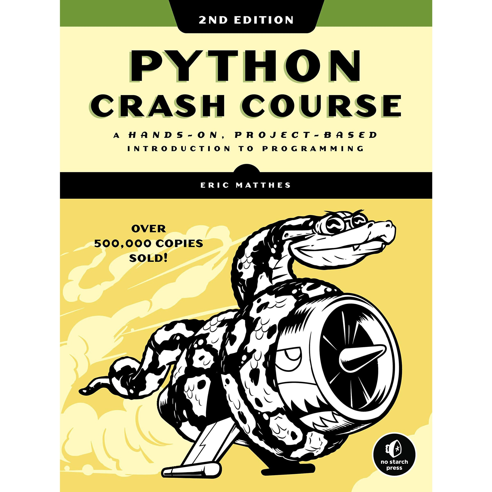
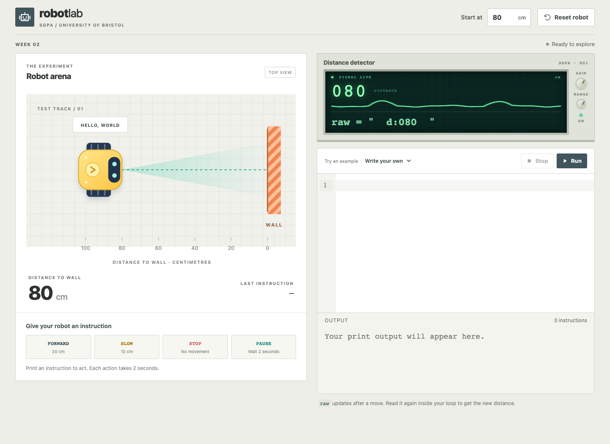

## Strings, branches and loops {#title}
Software Development: Programming and Algorithms

Dr Joseph Aylett-Bullock

## FAQs {#faqs}
- Single and double quotation marks
- `print()` statements with different types
- Binary number storage

[Week 1 FAQs notebook](https://github.com/JosephPB/2026-sdpa/blob/main/faqs/FAQs%20Week%201.ipynb){target="_blank"}

Space for questions from last week.

## Overview and reading {#overview}
:::: {.columns}
::: {.column width="45%"}
**Software Development: Programming and Algorithms**

This week:

- Strings, methods and slices
- Conditional statements and indentation
- `while`, `for`, `range`, `break` and `continue`

The robot example connects these ideas.
:::
::: {.column width="53%"}
<div class="book-row">
<figure><figcaption>Matthes<br>Ch. 5, §7.1</figcaption></figure>
<figure><figcaption>Downey<br>§5.4, §§7.3–7.4<br>§§8.1, 8.5</figcaption></figure>
<figure><figcaption>Guttag<br>§§2.2, 2.4</figcaption></figure>
</div>
:::
::::

## Strings and operators {#strings .terminal-demo}
::: {.presenter-cue}
Terminal
:::

## Robot Lab {#robot-intro .robot-demo}
:::: {.columns}
::: {.column width="50%"}
The robot begins **80 cm** from the wall. The detector supplies `raw`, a string such as `"  d:080  "`.

`print("FORWARD")` moves the robot **20 cm**.

[Open Robot Lab](https://josephpb.github.io/2026-sdpa/additional_materials/robot-lab/){.robot-link .demo-link target="robot-lab"}

:::
::: {.column width="48%"}
{.robot-image}
:::
::::

## String methods {#string-methods .ide-demo}
::: {.presenter-cue}
VS Code/IDE
:::

## Positions and slices {#indexing .keep-code .index-slide}
| Character | `P` | `Y` | `T` | `H` | `O` | `N` |
|:--|:--:|:--:|:--:|:--:|:--:|:--:|
| Index | 0 | 1 | 2 | 3 | 4 | 5 |
| Negative index | −6 | −5 | −4 | −3 | −2 | −1 |

```python
s = "PYTHON"
print(s[0])      # 'P'
print(s[-2])     # 'O'
print(s[0:3])    # 'PYT'
```

**`s[start:stop:step]`** includes start, excludes stop and defaults to a step of `1`.

## Slicing exercise {#slicing-board .activity-slide}
Drag tiles into the brackets. Predict before pressing **Slice**.

For `s = "PYTHON"`, what is `s[:3]`? **A** PYT  **B** PYTH  **C** YTH  **D** error

<iframe class="slice-frame" src="activities/slicing.html" title="Interactive Python string slicing board" allow="fullscreen" allowfullscreen></iframe>

[Open the slicing board](activities/slicing.html){target="slicing-board"}.

## Strings are immutable {#immutable .ide-demo}
::: {.presenter-cue}
VS Code/IDE
:::

## How do I remove the outside spaces and format the name properly in the fewest steps? {#format-name .ide-demo}
::: {.presenter-cue}
VS Code/IDE
:::

## Robot Lab: extracting the distance {#robot-distance .robot-demo}
The detector supplies a **string** such as `"  d:080  "`.

How do we extract the distance as an `int` and set it to `distance_cm`?


[Open Robot Lab](https://josephpb.github.io/2026-sdpa/additional_materials/robot-lab/){.robot-link .demo-link target="robot-lab"}

## One conditional block {#one-if .ide-demo .with-robot}
::: {.presenter-cue}
VS Code/IDE
:::

::: {.fragment .presenter-robot-cue}
[Then Robot Lab](https://josephpb.github.io/2026-sdpa/additional_materials/robot-lab/){.robot-link .demo-link target="robot-lab"}
:::

## A chain chooses at most one branch {#elif-chain .ide-demo}
::: {.presenter-cue}
VS Code/IDE
:::

## Multiple `if` statements {#independent-if .keep-code}
```{.python code-line-numbers="1|2-3|4-5|6"}
distance_cm = 20
if distance_cm <= 20:
    print("STOP")
if distance_cm <= 50:
    print("SLOW")
print("Done")
```

**A** `STOP, Done`  **B** `SLOW, Done`  **C** `STOP, SLOW, Done`

::: {.fragment}
**C.** Each `if` starts a separate decision. Indentation decides which statements belong to a block.
:::

## Nested decisions {#nested-decisions .ide-demo}
::: {.presenter-cue}
VS Code/IDE
:::

## `while` loop {#while-loop .ide-demo .with-robot}
::: {.presenter-cue}
VS Code/IDE
:::

::: {.fragment .presenter-robot-cue}
[Then Robot Lab](https://josephpb.github.io/2026-sdpa/additional_materials/robot-lab/){.robot-link .demo-link target="robot-lab"}
:::

## A stale reading {#stale-reading .keep-code}
```{.python code-line-numbers="1-3|5-6"}
raw = " d:080 "
message = raw.strip()
distance_cm = int(message[2:])

while distance_cm > 20:
    print("FORWARD")
```

What happens next? **A** Stops at 20  **B** Keeps printing FORWARD  **C** Does not print

::: {.fragment}
**B.** `distance_cm` still contains `80`. In Robot Lab, read and convert the supplied `raw` after each move; do not overwrite it with a fixed string.
:::

## Repetition with keyboard input {#input-loop .ide-demo}
::: {.presenter-cue}
VS Code/IDE
:::

## `for` loops and `range` {#for-sequence .ide-demo}
::: {.presenter-cue}
VS Code/IDE
:::

## Reassigning the variable in the loop {#fixed-range .keep-code}
```{.python code-line-numbers="1-2|3-4"}
x = 4
for i in range(x):
    print(i)
    x = 5
```

**A** `0, 1, 2, 3`  **B** `0, 1, 2, 3, 4`  **C** Never finishes

::: {.fragment}
**A.** Changing `x` does not rebuild the existing range for this loop.
:::

## `break` and `continue` {#route-control .ide-demo}
::: {.presenter-cue}
VS Code/IDE
:::

## Robot Lab: a route string {#robot-route .robot-demo}
Reset to **80 cm**. Build a `for` loop for `"FFPFSFF"`.

**F** means FORWARD. **S** means STOP and `break`. **P** means PAUSE and `continue`.

Final distance: **A** 0  **B** 20  **C** 40  **D** 60 cm

::: {.fragment}
**B.** Three moves, one pause, then STOP. The final two `F`s are skipped.
:::

[Open Robot Lab](https://josephpb.github.io/2026-sdpa/additional_materials/robot-lab/){.robot-link .demo-link target="robot-lab"}

## `break` in the innermost loop {#nested-break .ide-demo}
::: {.presenter-cue}
VS Code/IDE
:::

## References {#references}
- **Python Crash Course**, 2nd ed., Eric Matthes: chapter 5 and §7.1.
- **Think Python**, Allen B. Downey: §5.4, §§7.3–7.4, §§8.1 and 8.5, using the course edition.
- **Introduction to Computation and Programming Using Python**, 2nd ed., John V. Guttag: §§2.2 and 2.4.

[Week 1 FAQs notebook](https://github.com/JosephPB/2026-sdpa/blob/main/faqs/FAQs%20Week%201.ipynb){target="_blank"}

The following two slides collect additional examples for reference.

## Reference: string methods {#strings-reference .keep-code}
:::: {.columns}
::: {.column width="48%"}
```python
s = "  ada LOVELACE  "
print(s.upper())
print(s.lower())
print(s.title())
print(repr(s.lstrip()))
print(repr(s.rstrip()))
print(repr(s.strip()))
print(len(s))
```
:::
::: {.column width="50%"}
```python
s = "PYTHON"
print(s[:3])
print(s[3:])
print(s[::2])
print(s[::-1])
print(str(80), int("080"))
```
:::
::::

Strings are immutable. Methods return values; assignment chooses what a name refers to. `len()` counts Unicode code points, which need not equal the number of visible symbols.

## Reference: looping approaches {#loop-reference .keep-code}
:::: {.columns}
::: {.column width="32%"}
**Characters directly**

```python
s = "FFPFSFF"
for ch in s:
    print(ch)
```
:::
::: {.column width="32%"}
**Positions from `range`**

```python
s = "FFPFSFF"
for i in range(len(s)):
    print(i, s[i])
```
:::
::: {.column width="32%"}
**A `while` counter**

```python
s = "FFPFSFF"
i = 0
while i < len(s):
    print(i, s[i])
    i += 1
```
:::
::::

Direct iteration is usually clearest when only the character matters. A `while` counter needs an explicit update.
