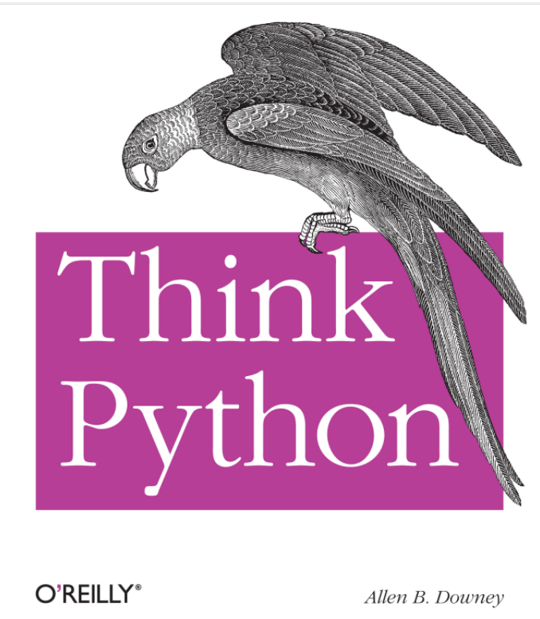
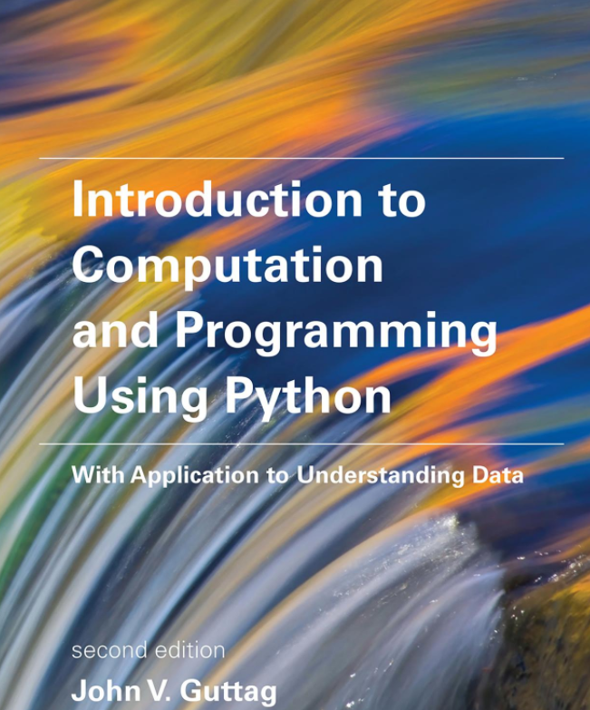

## Objects and collections {#title}

Software Development: Programming and Algorithms

Delivered by: Dr Joseph Aylett-Bullock

Week 3

## Questions from week 2 {#recall .keep-code}

```python
s = "PYTHON"
print(s[1:5:2])
for letter in s[:2]:
    print(letter)
```

What does the slice select? 

How many letters are printed out from the for loop?

::: {.answer}
The first line prints `YH`. The loop prints `P`, then `Y`: two iterations.
:::

## Overview and reading {#overview}

:::: {.columns}
::: {.column width="45%"}
This week:

- Objects, names and references
- Tuples, lists and copying
- Dictionaries and sets
- Unpacking and looping

:::
::: {.column width="53%"}
<div class="book-row">
<figure><figcaption>Matthes<br>Ch. 3, 4 and 6</figcaption></figure>
<figure><figcaption>Downey<br>Ch. 10, 11 and 12</figcaption></figure>
<figure><figcaption>Guttag<br>§§5.1, 5.2 and 5.5</figcaption></figure>
</div>
:::
::::

::: {.notes}
Explain that prizes recognise volunteering and explaining a reasoned attempt, including revising an answer. Keep a volunteer list. Sources: TL 2–3 and DS 2–3. Readings use the editions shown in the original materials.
:::

## Objects: identity, type and value {#objects .terminal-demo}

```python
number = 4
print(number)
print(isinstance(number, object))
print(type(number))
print(id(number))
```

**Value:** what the object represents

**Type:** what can be done with the object (operations)

**Identity:** is the memory address assigned to it. `id()` stays constant during its lifetime.

## Objects: variables {#references .activity-slide}

Predict which label moves when `x` receives a new value.

<iframe class="slice-frame" src="activities/objects.html?scene=rebind" title="Names and objects: assignment and rebinding" allow="fullscreen" allowfullscreen></iframe>

[Open the object board](activities/objects.html?scene=rebind){target="objects-board"}.

## Equality and identity {#identity .keep-code}

```python
a = 1
b = a
c = 1.0
print(a == c)
print(a is c)
print(a is b)
```

**A** True, True, True  **B** True, False, True  **C** False, False, True

::: {.answer}
**B.** `==` compares values. `is` compares identity. `a` and `b` refer to one integer; `c` is a separate float with the same numeric value as `a`.
:::

## Structured data types {#structures}

- We have so far met: `int`, `float`, `bool` and `str`.

- Numeric/Boolean types are scalar which have no accessible internal structure

- `str` can be thought of as a structured, or non-scalar, type
    - Indexing and slicing 

- `tuples`, `list` and `dict`ionaries are *structured* / *compound* data types in Python. 

## Tuples {#tuple-introduction}

- Like string, tuples are ordered sequence of elements

- Difference is that elements in tuples do not have to be characters

- Each element can be of any type

- Represented with parentheses

- Normally used to return more than one value from a function


## Tuples: coordinates example {#tuples .ide-demo}

```python
A = (0, 0)
B = (4, 0)
C = (4, 3)
D = (0, 3)
print(B[0], B[1])
print(type(B), len(B))
print(type((4,)), type((4)))
```

A tuple is an ordered sequence. Its elements can have different types: `("A", 2, 1.5)`.

The comma creates a one-element tuple: `(4,)`.

## Tuple slicing {#slicing .activity-slide}

Build a slice that selects **B and D**. Predict before pressing **Slice**.

<iframe class="slice-frame" src="activities/slicing.html" title="Tap-to-build tuple and list slicing board" allow="fullscreen" allowfullscreen></iframe>

[Open the sequence board](activities/slicing.html){target="sequence-board"}. Try `1:5:2`, `-3:` and `::-1`.

## Tuple mutation and reassignment {#tuple-mutation .ide-demo}

:::: {.columns}
::: {.column width="48%"}
An item assignment:

```python
A = (0, 0)
#A[0] = 2 - cannot do this
```

**Expected:** `TypeError`.
:::
::: {.column width="50%"}
Binding the name to another tuple:

```python
A = (0, 0)
A = (2, 0)
print(A)
```

**Result:** `(2, 0)`.
:::
::::

A tuple is **immutable**.

The name `A` can refer to a different tuple.

## Packing and unpacking tuples {#unpacking-tuples .ide-demo}

:::: {.columns}
::: {.column width="48%"}
```python
B = (4, 0)  # Also written B = 4, 0
x, y = B
print(x, y)
for coordinate in B:
    print(coordinate)
```
:::
::: {.column width="50%"}
```python
first = (1, 2)
second = (3, 4)
print(first + second)
print((first, second))
```

Concatenation: `(1, 2, 3, 4)`.

Nesting: `((1, 2), (3, 4))`.
:::
::::

Unpacking assigns each element to a name. The number of names must match here.

Tuples can be concatenated.

## Lists {#lists .ide-demo}

```python
A, B, C, D = (0, 0), (4, 0), (4, 3), (0, 3)
route = [A, C, B, D]
print(route[1])
print(route[-1])
print(route[1:3])
route[1], route[2] = route[2], route[1]
print(route)
```

Lists are ordered and mutable, and can mix element types. Here each element is a coordinate tuple.

The final assignment swaps the references stored at positions 1 and 2. The coordinate tuples stay unchanged.

## The travelling duck problem {#duck-delivery .activity-slide .duck-demo}

Visit every station once and return to **A** only at the end. Can you improve on **A, C, B, D, A**?

<iframe class="slice-frame" src="activities/route.html" title="Duck delivery: choose and compare routes" allow="fullscreen" allowfullscreen></iframe>

[Open the delivery map](activities/route.html){target="duck-map"}.

## Iterating through a route {#iteration .ide-demo}

:::: {.columns}
::: {.column width="48%"}
```python
route = ["A", "C", "B", "D"]
for stop in route:
    print(stop)
for i in range(len(route)):
    print(i, route[i])
```
:::
::: {.column width="50%"}
```python
legs = [5, 3, 5, 3]
total = 0
for distance in legs:
    total += distance
print(total)
```

The crossed tour totals **16 model units**, including the return leg.
:::
::::

## What is the dot? {#dot}

- Lists are Python objects, everything in Python is an object

- objects have data

- objects can expose attributes and methods

- Use `object_name.attribute` to read an attribute, or `object_name.method()` to call a method

- Will learn more about these later

## Adding and extending list elements {#adding .activity-slide}

Compare **append**, **extend** and **+** from the same starting list. What does the dot mean?

<iframe class="slice-frame" src="activities/lists.html?scene=add" title="List methods: append, extend and concatenation" allow="fullscreen" allowfullscreen></iframe>

[Open the list board](activities/lists.html?scene=add){target="list-board"}. A **method** such as `route.append(...)` acts on the object before the dot.

## Inserting and removing stops {#removing .activity-slide}

An **index** selects a position. A **value** selects the first matching element.

<iframe class="slice-frame" src="activities/lists.html?scene=remove" title="List insertion, pop, remove and del" allow="fullscreen" allowfullscreen></iframe>

[Open the list board](activities/lists.html?scene=remove){target="list-board"}. Predict which element disappears and what the operation returns.


## Ordering and method outputs {#ordering .ide-demo}

:::: {.columns}
::: {.column width="48%"}
```python
legs = [5, 3, 5, 3]
ordered = sorted(legs)
print(ordered)
print(legs)
result = legs.sort()
print(legs, result)
```
:::
::: {.column width="50%"}
```python
stops = ["A", "B", "C", "A"]
stops.reverse()
print(stops.count("A"))
```

`sorted()` returns a new list.

`.sort()` changes the list and returns `None`.
:::
::::

Sorting the individual leg lengths leaves the total unchanged. To optimise, we will sort **complete tours by their total distance**.

## List building {#comprehensions .ide-demo}

:::: {.columns}
::: {.column width="48%"}
```python
squares = []
for x in range(1, 6):
    squares.append(x ** 2)
print(squares)
```
:::
::: {.column width="50%"}
```python
squares = []
for x in range(1, 6):
    squares.append(x**2)
print(squares)

long_legs = []
for d in [5, 3, 5, 3]:
    if d > 3:
        long_legs.append(d)
print(long_legs)
```
:::
::::

The expression builds each element. The `for` chooses inputs. An optional `if` filters them.

## The trial route changes the original {#alias .activity-slide}

We want to try a new trial route while keeping the original. Does `trial = route` achieve that?

<iframe class="slice-frame" src="activities/objects.html?scene=alias" title="Two variable names sharing one route list" allow="fullscreen" allowfullscreen></iframe>

[Open the object board](activities/objects.html?scene=alias){target="objects-board"}. Use two name labels and one physical route sheet.

## Copying a route {#copy .ide-demo}

```python
route = ["A", "C", "B", "D"]
trial = route.copy()
trial[1], trial[2] = trial[2], trial[1]
print(route)
print(trial)
print(route is trial)
```

`route.copy()` and `route[:]` create a new outer list.

The original route stays `['A', 'C', 'B', 'D']`. The trial becomes `['A', 'B', 'C', 'D']`.

::: {.notes}
Three minutes. Introduce the second physical route sheet, reset and repeat. A shallow copy is sufficient for reordering immutable coordinate tuples. Source: ML 6. https://docs.python.org/3/library/copy.html
:::

## Nested lists share inner objects {#nested-lists .activity-slide}

Copying the outer list leaves its elements referring to the same inner objects.

<iframe class="slice-frame" src="activities/objects.html?scene=nested" title="Shallow copying a nested list" allow="fullscreen" allowfullscreen></iframe>

[Open the object board](activities/objects.html?scene=nested){target="objects-board"}. Predict `groups` after `trial[0].append("D")`.

**Later:** `copy.deepcopy()` also copies nested mutable objects. We will meet library imports in a later session.

## Removing items during iteration {#mutation-loop .activity-slide}

Remove A and B. Predict what happens as the list shifts beneath the loop's next index.

<iframe class="slice-frame" src="activities/lists.html?scene=iterate" title="Step through removing list elements while iterating" allow="fullscreen" allowfullscreen></iframe>

[Open the iteration board](activities/lists.html?scene=iterate){target="list-board"}. Compare iterating over the original with iterating over a copy.

What about if we used `.append()` inside the `for` loop?

## Copying quiz {#copy-quiz .keep-code}

```python
a = ["A", "B"]
b = a.copy()
print(a == b)
print(a is b)
```

**A** True, True  **B** True, False  **C** False, True  **D** False, False

::: {.answer}
**B.** Equal contents, separate list objects. Replacing an element of `b` leaves `a` unchanged.
:::

## Every visiting order {#route-candidates .ide-demo}

Fix A as the start. Extend each partial route with every **unvisited** stop.

```python
A, B, C, D = (0, 0), (4, 0), (4, 3), (0, 3)
stops = [B, C, D]
routes = [[A]]
for step in range(len(stops)):
    longer_routes = []
    for route in routes:
        for stop in stops:
            if stop not in route:
                longer_routes.append(route + [stop])
    routes = longer_routes
print(len(routes))
```

There are **6 permutations** of B, C and D. Order matters. `+` creates a new route each time.

::: {.notes}
Build live/07_route_lists.py, step 1. Ask the class for the counts after each pass: 3, 6, 6. Trace A-B: its next choices are C and D. The outer list holds possible routes; each inner list is one route. We read routes and build a separate longer_routes list. This simple coordinate version assumes distinct positions; named dictionary keys later distinguish stops even if they share coordinates. No stop repeats inside a candidate. Add the final return to A only when scoring.
:::

## The distance of one complete tour {#route-distance .ide-demo}

Each leg uses Pythagoras: `((x2 - x1)**2 + (y2 - y1)**2)**0.5`.

```python
A, B, C, D = (0, 0), (4, 0), (4, 3), (0, 3)
route = [A, C, B, D]
closed = route + [route[0]]
total = 0
for i in range(len(closed) - 1):
    x1, y1 = closed[i]
    x2, y2 = closed[i + 1]
    total += ((x2 - x1)**2 + (y2 - y1)**2)**0.5
print(total)
```

The crossed tour is **16 model units**. Changing the order to `[A, B, C, D]` gives **14**.

::: {.notes}
Build step 2 in the same script. Each adjacent pair contributes one distance. Closing the list adds the last-to-first leg, rather than letting A appear during candidate generation. All four positions here are distinct. Reuse the physical map to check the calculation.
:::

## The shortest tour from the list {#route-ranking .ide-demo}

Continue in the same IDE script, using the six `routes` from step 1.

::: {.no-run}
```python
scores = []
for route in routes:
    closed = route + [route[0]]
    total = 0
    for i in range(len(closed) - 1):
        x1, y1 = closed[i]
        x2, y2 = closed[i + 1]
        total += ((x2 - x1)**2 + (y2 - y1)**2)**0.5
    scores.append((total, route))
ranked = sorted(scores)
best_distance, best_route = ranked[0]
print(best_distance)
print(best_route + [best_route[0]])
```
:::

Sort `(distance, route)` pairs by distance first. The best distance is **14**; both perimeter directions tie.

::: {.notes}
Build step 3. Open live/07_route_lists.py for the complete runnable sequence. Do not run this continuation alone. sorted compares tuples left to right; tied distances use the coordinate-list ordering, which is valid for these numeric tuples. In this version A-D-C-B wins that tie. We keep all six candidates, including the reverse of each tour. Ask why sorting only the individual legs would not solve the problem.
:::

## The travelling salesman problem {#travelling-salesman}

Find the shortest complete tour that visits every stop once and returns to its start.

| Total stops, including A | Visiting orders with A fixed |
|---|---:|
| 4 | 3! = 6 |
| 8 | 7! = 5,040 |
| 12 | 11! = 39,916,800 |
| 16 | 15! = 1,307,674,368,000 |

Our exhaustive search checks **(n − 1)!** orders. Reversed tours count separately.

The optimisation problem is **NP-hard**. A polynomial-time algorithm for every input is not known. The factorial count describes **our method**, rather than proving NP-hardness.

[Complete lists script](https://github.com/JosephPB/2026-sdpa/blob/main/lecture_code/week3/live/07_route_lists.py){target="route-script"} · [Why NP-hard?](#reference-np-hard)

::: {.notes}
Three minutes. The fixed-start count still includes reversed tours, matching both scripts. Symmetric distances allow reversal pairs to be identified, but this does not remove factorial growth. Explain NP-hard as at least as hard as every problem in NP under polynomial-time reductions. The decision form with integer weights is NP-complete. An efficient general TSP optimiser would solve that decision form. Formal reason: Hamiltonian cycle reduces to TSP; see the reference slide. Factorial enumeration is not a lower-bound proof for all algorithms. The four-stop example is small and solvable exactly. Source: https://www.cs.princeton.edu/~wayne/kleinberg-tardos/pearson/08PolynomialTimeReductions.pdf (slide 18). Dictionaries later improve representation, not this growth rate.
:::

## Dictionaries: looking up a stop by name {#why-dictionaries}

:::: {.columns}
::: {.column width="48%"}
Two lists must stay aligned:

```python
names = ["A", "B", "C"]
positions = [(0, 0), (4, 0), (4, 3)]
print(positions[names.index("B")])
```
:::
::: {.column width="50%"}
A dictionary associates a key with a value:

```python
locations = {"A": (0, 0),
             "B": (4, 0),
             "C": (4, 3)}
print(locations["B"])

print(type(locations))
```
:::
::::

The route can now store stop names and use a dictionary to look up their coordinates.

## Three ways to create a dictionary {#dictionary-constructors .ide-demo}

```python
literal = {"A": (0, 0), "B": (4, 0)}
keywords = dict(A=(0, 0), B=(4, 0))
pairs = dict([("A", (0, 0)), ("B", (4, 0))])
print(literal == keywords == pairs)
```

- **Literal:** put `key: value` pairs inside braces.
- **Keywords:** names such as `A` become string keys. They must be valid keyword argument names.
- **Pairs:** each item supplies a key and its value.

`{}` and `dict()` both create an empty dictionary. All three examples above contain the same entries.

::: {.notes}
Explicitly teach all three forms from original Dictionaries and Sets slide 9. Keywords cannot directly express a key such as "stop A" or a numeric/tuple key; use a literal or pairs. Position tuples as dictionary values preserve the duck example. Reference: https://docs.python.org/3/library/stdtypes.html#dict
:::

## Creating and changing dictionaries {#dictionary-basics .ide-demo}

```python
stock = {"A": 2, "B": 1}
print(stock["A"])
stock["B"] = 3
stock["C"] = 1
print(stock)
print(stock.get("D", 0))
print("D" in stock)
```

Assignment updates an existing key or adds a new one. `.get("D", 0)` supplies a default without inserting D.

Directly reading `stock["D"]` would raise `KeyError`.

::: {.notes}
Four minutes. Predict whether get changes the dictionary. Dictionaries preserve insertion order. Compare with the three constructors on the preceding slide. Sources: DS 9–10.
:::

## Keys, values and membership {#dictionary-membership .keep-code}

:::: {.columns}
::: {.column width="48%"}
```python
stock = {"A": 2, "B": 0}
print("B" in stock)
print(2 in stock)
print(2 in stock.values())
```

**A** True, True, True<br>**B** True, False, True<br>**C** False, False, True
:::
::: {.column width="50%"}
```python
stock = {"A": 2, "B": 0}
print(list(stock.keys()))
print(list(stock.items()))
removed = stock.pop("B")
del stock["A"]
print(removed, stock)
```
:::
::::

::: {.answer}
**B.** Membership tests keys. Keys are unique and hashable. Values may repeat or be mutable.
:::

::: {.notes}
Four minutes. keys/values/items provide views, not tuples. A tuple of numbers is a possible key; a list is not. The reference includes a tuple-key example. Sources: DS 11–16.
:::

## Named routes with a dictionary {#route-dictionary .ide-demo}

**Exercise:** 
- Can you construct the same search over all possible routes, with a dictionary linking each unique stop name to its coordinates?

- Can you then sort the routes by length to find the shortest one?

[Answer: complete dictionary script](https://github.com/JosephPB/2026-sdpa/blob/main/lecture_code/week3/live/08_route_dictionary.py){target="route-script"}.

## Nested dictionaries {#nested-dictionaries .ide-demo}

```python
deliveries = {
    "A": {"position": (0, 0), "ducks": 2},
    "B": {"position": (4, 0), "ducks": 1}
}
print(deliveries["B"]["position"])
deliveries["B"]["ducks"] += 1
print(deliveries["B"])
```

Each stop has a record. Each record contains values with their own types.

A list could also hold records: `[deliveries["A"], deliveries["B"]]`.

::: {.notes}
Three minutes. Trace the two lookups aloud. Reuse the same record structure at each stop. Sources: DS 17–20.
:::

## Unpacking dictionaries {#unpacking-iterables .ide-demo}

```python
x, y = (4, 3)
first, second = ["A", "B"]
letter1, letter2 = "AB"
stock = {"A": 2, "B": 1}
a, b = stock
q1, q2 = stock.values()
item1, item2 = stock.items()
print(a, b)
print(q1, q2)
print(item1, item2)
```

Iterating over a dictionary gives its **keys**. Each item is a `(key, value)` pair. Strings unpack into characters.

::: {.notes}
Two minutes. Ask what a and b contain before running. The example uses dictionary insertion order. Unpacking works with strings too, as in the original. Sources: DS 21–22.
:::

## Merging dictionaries {#merging .ide-demo}

:::: {.columns}
::: {.column width="48%"}
In your Python IDE:

::: {.no-run}
```python
stock = {"A": 2, "B": 1}
changes = {"B": 3, "C": 1}
combined = {**stock, **changes}
print(combined)
```
:::
:::
::: {.column width="50%"}
Equivalent copy and update:

```python
stock = {"A": 2, "B": 1}
changes = {"B": 3, "C": 1}
combined = stock.copy()
combined.update(changes)
print(combined)
```
:::
::::

`**` is the unpacking operator

**Prediction:** what is `combined["B"]`? **Answer:** `3`. The later mapping wins; `stock` stays unchanged.

::: {.notes}
Two minutes. The inherited browser Python runtime does not support dictionary ** unpacking; the exact original syntax stays visible for the IDE, with an equivalent runnable example beside it. Sources: DS 23–24. https://docs.python.org/3/tutorial/datastructures.html
:::

## Sets {#set-introduction}

Unordered, finite collection of distinct, hashable elements

```python
fav_animals = {'Alpaca', 'Kangaroo', 'Koala'}
```

Why sets?

- Fast membership testing
- Eliminate duplicate entries
- Easy set operations (intersection, union, etc.)

## Sets record distinct locations {#sets .ide-demo}

```python
route = ["A", "B", "A", "C"]
visited = set(route)
print(len(route), len(visited))
print("B" in visited)
print(type(set()), type({}))
```

The route contains four visits. The set contains three distinct stop names.

Sets are unordered and contain hashable elements. Use **`set()`** for an empty set; **`{}`** creates a dictionary.

::: {.notes}
Two minutes. A set cannot preserve the order and repetitions of a delivery route. Do not ask students to predict set print order. Sources: DS 25–27.
:::

## Set membership quiz {#set-quiz .keep-code}

```python
visited = {"A", "B", "A"}
visited.add("B")
print(len(visited))
print("C" in visited)
```

**A** 4, False  **B** 3, False  **C** 2, False  **D** 2, True

::: {.answer}
**C.** Adding an element already present does not add another copy. C has not been visited.
:::

::: {.notes}
Two minutes. The distinction is membership, not ordering. Sources: DS 26–27.
:::

## Required and visited stops {#set-operations .activity-slide}

Which locations still need a delivery? Select your prediction, then reveal the result.

<iframe class="slice-frame" src="activities/sets.html" title="Set operations on required and visited delivery stops" allow="fullscreen" allowfullscreen></iframe>

[Open the set board](activities/sets.html){target="set-board"}. Compare difference, intersection, union and symmetric difference.

::: {.notes}
Five minutes. required = {A,B,C,D}; visited = {A,C,E}. Difference is B/D, intersection A/C, union all five, symmetric difference B/D/E. The extra E distinguishes several answers. Sets have no display order. Sources: DS 28–31.
:::

## Looping through dictionary items {#dictionary-loops .ide-demo}

```python
deliveries = {
    "A": {"position": (0, 0), "ducks": 2},
    "B": {"position": (4, 0), "ducks": 1}
}
for name, record in deliveries.items():
    print(name, record["ducks"])
```

Each iteration unpacks one `(key, value)` pair (as a `tuple`).

Here the value is a dictionary, so `record["ducks"]` reads its quantity.

::: {.notes}
Two minutes. Reuse the nested data rather than introduce a fresh story. Sources: DS 32–33.
:::

## Zip {#zip-introduction}

- `zip()` pairs corresponding elements from iterables, such as two sequences

- The name of the function refers to a zipper, which interleaves two rows of teeth

- The result is an iterator of tuples, one element from each input

- The most common use of zip is in a for loop


## Pairing sequences with zip {#zip .ide-demo}

```python
stops = ["A", "B", "C"]
quantities = [2, 1]
for stop, quantity in zip(stops, quantities):
    print(stop, quantity)
```

**Prediction:** is there an output line for C?

::: {.answer}
No. Ordinary `zip()` ends when the shortest input ends. It yields pairs through an iterator.
:::

::: {.notes}
Two minutes. An iterator is not an indexable list. In the IDE, adding a third quantity makes the third pair. Sources: DS 34–35.
:::

## Numbering stops with enumerate {#enumerate .ide-demo}

```python
route = ["A", "C", "B", "D"]
for index, stop in enumerate(route):
    print(index, stop)
```

`enumerate()` yields an index and an element together.

```python
route = ["A", "C", "B", "D"]
for visit, stop in enumerate(route, start=1):
    print(visit, stop)
```

## Explain it to the duck: the backup {#clinic-alias .keep-code}

```python
route = ["A", "B", "C"]
backup = route
route.pop()
print(backup)
```

**A** `['A', 'B', 'C']`  **B** `['A', 'B']`  **C** `None`  **D** Error

::: {.answer}
**B.** Both names refer to the same list. To keep the original contents, use `backup = route.copy()` before the removal.
:::

## Explain it to the duck: the return value {#clinic-return .keep-code}

```python
stops = ["A", "B"]
result = stops.append("C")
print(stops)
print(result)
```

What are the **two** printed results? Explain each line before running it.

::: {.answer}
`['A', 'B', 'C']`, then `None`. `append` changes the list and returns `None`.
:::


## Explain it to the duck: missing deliveries {#clinic-sets .keep-code}

```python
required = {"A", "B", "C", "D"}
visited = {"A", "C", "E"}
missing = required - visited
print(missing)
```

**A** A and C  **B** B and D  **C** B, D and E  **D** All five

::: {.answer}
**B.** B and D are required but have not been visited. Either printed order is valid.
:::

## Choosing a collection {#takeaways}

| What do we need to represent? | A useful choice |
|---|---|
| One coordinate pair | Tuple: `(4, 3)` |
| An editable visiting order | List: `["A", "C", "B", "D"]` |
| A record looked up by name | Dictionary: `{"A": (0, 0)}` |
| Distinct locations visited | Set: `{"A", "B", "C"}` |

How would you keep a route unchanged while trying a new order?

## Reference: tuples and lists {#reference-sequences .reference-slide}

| Operation | Example | Meaning |
|---|---|---|
| Empty sequences | `()` and `[]` | Empty tuple and list |
| One-element tuple | `("A",)` | The comma matters |
| Index | `route[-1]` | Last element; invalid index raises `IndexError` |
| Slice | `route[1:4:2]` | Indices 1 and 3; stop excluded |
| Concatenate | `[1, 2] + [3]` | A new list `[1, 2, 3]` |
| Repeat | `["A"] * 3` | `["A", "A", "A"]` |
| Append / extend | `a.append(b)` / `a.extend(b)` | One element / each element of b |
| Remove | `a.pop(i)` / `a.remove(x)` | By index with return / first equal value |

Methods such as `append`, `extend`, `sort` and `reverse` mutate a list and return `None`.


## Reference: copying and mutation {#reference-copying .reference-slide}

:::: {.columns}
::: {.column width="48%"}
```python
route = ["A", "B", "C", "D"]
for stop in route.copy():
    if stop in ["A", "B"]:
        route.remove(stop)
print(route)
```

Iterate over a copy while changing the original.
:::
::: {.column width="50%"}
```python
route = ["A", "B", "C", "D"]
route = [stop for stop in route
         if stop not in ["A", "B"]]
print(route)
```

Or build a new filtered list and rebind the name.
:::
::::

Shallow copies share contained objects. A tuple can contain a mutable list, and that list can still change.

## Reference: dictionaries {#reference-dictionaries .reference-slide}

:::: {.columns}
::: {.column width="48%"}
```python
by_key = {42: "A", 2.5: "B",
          True: "C"}
print(by_key[42], by_key[2.5],
      by_key[True])
by_position = {(0, 0): "A"}
print(by_position[(0, 0)])
```
:::
::: {.column width="50%"}
- Keys are unique and hashable.
- A list cannot be a key.
- A tuple containing a list is also unhashable.
- Membership tests keys.
- `keys()`, `values()` and `items()` return views.
- Dictionaries preserve insertion order.
:::
::::

`d[key]` raises `KeyError` if absent. `d.get(key, default)` supplies a default without adding the key.

## Reference: nesting collections {#reference-nesting .reference-slide}

:::: {.columns}
::: {.column width="48%"}
A list of dictionaries:

```python
records = [{"stop": "A", "ducks": 2},
           {"stop": "B", "ducks": 1}]
print(records[1]["ducks"])
```
:::
::: {.column width="50%"}
A list and a dictionary inside a dictionary:

```python
delivery = {
    "stops": ["A", "C", "B"],
    "courier": {"name": "Duck"}
}
print(delivery["stops"][-1])
print(delivery["courier"]["name"])
```
:::
::::

A dictionary can map many names to similar records, or hold different fields of one record.

::: {.notes}
Sources: original DS 13–20. Ask for the type reached by each lookup before the next lookup or index. Values may have different types and may repeat. Nesting is composition of the same collection operations.
:::

## Reference: sets and looping {#reference-sets .reference-slide}

| Expression | Meaning |
|---|---|
| `a - b` | In a and not in b |
| `a & b` | In both a and b |
| `a \| b` | In either set or both |
| `a ^ b` | In exactly one set |
| `for key, value in d.items():` | Unpack each dictionary entry |
| `for a, b in zip(xs, ys):` | Pair elements; ordinary zip stops at the shorter input |
| `for i, value in enumerate(xs):` | Pair each element with its index |

Sets have no indexing or guaranteed iteration order. `zip` and `enumerate` yield iterators.

## Reference: distance from coordinates {#reference-distance .reference-slide}

```python
A, B, C, D = (0, 0), (4, 0), (4, 3), (0, 3)
route = [A, C, B, D]
closed = route + [route[0]]
total = 0
for i in range(len(closed) - 1):
    x1, y1 = closed[i]
    x2, y2 = closed[i + 1]
    total += ((x2 - x1)**2 + (y2 - y1)**2)**0.5
print(total)
```

The final added A closes the tour. Compare with `route = [A, B, C, D]`.

[Python docs: data structures](https://docs.python.org/3/tutorial/datastructures.html) · [Python docs: copying objects](https://docs.python.org/3/library/copy.html)

## Reference: why TSP is NP-hard {#reference-np-hard .reference-slide}

**Proof idea for general weighted TSP:** an efficient optimiser would also solve the NP-complete Hamiltonian cycle problem.

1. Start with a graph. The question is whether a cycle visits every vertex exactly once.
2. Make every vertex a city. Give an existing graph edge cost **1**, and a missing edge cost **2**.
3. A tour through n cities uses n edges. Its cost is at most **n** exactly when it uses only original graph edges.

So finding the shortest TSP tour answers the original cycle question. Building the distance table takes polynomial time.

This is a **reduction**. It proves hardness; counting our search's permutations alone does not. NP-hard does not mean every small instance is difficult.

[Princeton: polynomial-time reductions, slide 18](https://www.cs.princeton.edu/~wayne/kleinberg-tardos/pearson/08PolynomialTimeReductions.pdf)

::: {.notes}
Optional mathematical extension. This construction is for general weighted TSP and is not a proof for Euclidean distances in the plane. The original graph is an undirected simple graph; its NP-complete Hamiltonian cycle question embeds into a complete weighted graph. The decision version asks whether a tour costs at most a given bound; an optimisation solution answers that immediately. Explain polynomial time informally as bounded by a fixed power of input size. Do not claim a proof that polynomial-time exact algorithms are impossible: that would settle P versus NP. The classroom coordinate example illustrates search and does not itself establish a complexity classification.
:::
